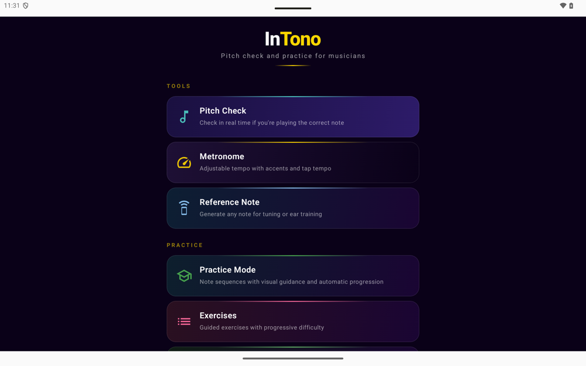
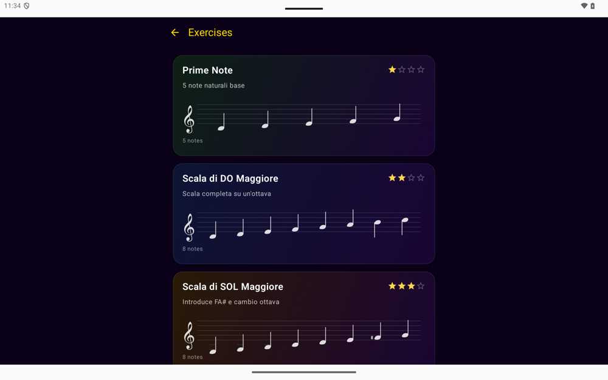
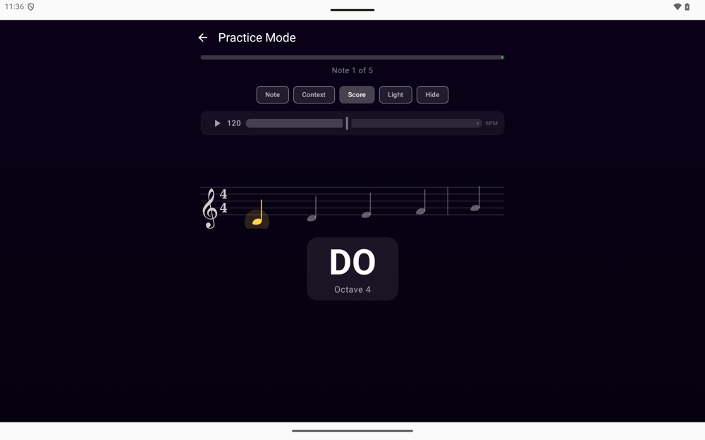
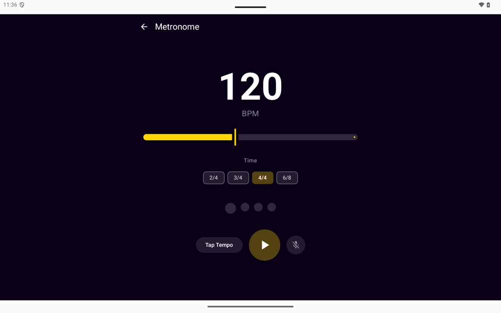

# InTono 🎻

[](https://github.com/luzadev/intono/actions/workflows/build.yml)
[](https://github.com/luzadev/intono/releases/latest)

**Intonazione e pratica per musicisti di ogni livello.** App multipiattaforma per l'apprendimento musicale costruita con **Kotlin Multiplatform** e **Compose Multiplatform**: rileva in tempo reale la nota che suoni (algoritmo YIN) e ti guida nella pratica su un pentagramma con notazione professionale.

| | |
|---|---|
|  |  |
|  |  |

## Funzionalità

- **Controllo intonazione** — rilevamento in tempo reale della nota al microfono (YIN, preset per violino, viola, violoncello, pianoforte, chitarra e voce) con deviazione in cents
- **Pratica guidata** — segui sequenze di note con avanzamento automatico; pentagramma in modalità Nota / Contesto / Spartito, tema chiaro e modalità "Nascondi" per la lettura
- **Pentagramma professionale** — glifi tipografici disegnati su Canvas, travature per crome e semicrome (anche in 6/8), stanghette di battuta con indicazione del tempo, diesis **e bemolle**, spaziatura proporzionale alla durata
- **Spartiti** — 12 brani celebri inclusi (Bach, Beethoven, Chopin, Pachelbel…), import MusicXML/MXL e scansione di spartiti da foto tramite AI (Claude / GPT-4o)
- **Metronomo** — 30–240 BPM su griglia temporale assoluta (niente drift), tempi 2/4–6/8, tap tempo e accordatore integrato
- **Ear training** — riconoscimento di note e intervalli con difficoltà progressiva
- **Sfida** — quante note corrette riesci a suonare nel tempo limite? Punteggio con bonus precisione/velocità e combo
- **Progressi** — obiettivi giornalieri con streak, statistiche con grafici e cronologia unificata ri-eseguibile

## Piattaforme

| Piattaforma | Stato | Requisiti |
|-------------|-------|-----------|
| Android     | ✅ | API 26+ (Android 8.0) |
| iOS         | ✅ | iOS 16+, Xcode 15+ |
| macOS/Desktop | ✅ | JVM 17+ (Compose Desktop) |

## Download

L'APK Android firmato è allegato a ogni [release](https://github.com/luzadev/intono/releases/latest). Gli APK di sviluppo sono disponibili come artifact di ogni [build CI](https://github.com/luzadev/intono/actions/workflows/build.yml).

## Architettura

```
NoteMusicali/
  app/              # Entry point Android
  desktopApp/       # Entry point Desktop (JVM)
  iosApp/           # Entry point iOS (SwiftUI + XcodeGen)
  shared/           # Kotlin Multiplatform
    commonMain/     #   UI Compose, DSP (YIN), notazione, parser MusicXML,
                    #   geometria e rendering del pentagramma, motori di gioco
    androidMain/    #   AudioRecord, CameraX, EncryptedSharedPreferences, SAF
    iosMain/        #   AVAudioEngine, UIImagePickerController, Keychain, zlib
    desktopMain/    #   javax.sound, Swing file picker
```

Tutta la logica (pitch detection, notazione, layout del pentagramma, motori di pratica/sfida) vive in `commonMain` ed è coperta da test (`commonTest`, ~110 test eseguiti su JVM e simulatore iOS). Le piattaforme forniscono solo I/O: audio, camera, storage sicuro, file system.

## Build

```bash
# Test
./gradlew :shared:desktopTest              # suite su JVM
./gradlew :shared:iosSimulatorArm64Test    # suite su simulatore iOS

# Android
./gradlew :app:assembleDebug               # APK in app/build/outputs/apk/debug/

# Desktop
./gradlew :desktopApp:run                  # esegui
./gradlew :desktopApp:packageDmg           # DMG per macOS

# iOS
cd iosApp && xcodegen generate && open iosApp.xcodeproj
```

Per l'APK di release firmato servono le variabili d'ambiente `INTONO_KEYSTORE_PATH`, `INTONO_KEYSTORE_PASSWORD`, `INTONO_KEY_ALIAS`, `INTONO_KEY_PASSWORD` (in CI arrivano dai secrets della repo: il workflow [Release](.github/workflows/release.yml) parte a ogni tag `v*`).

## Stack

Kotlin 2.1 · Compose Multiplatform 1.7 · Ktor 3 · kotlinx-serialization · multiplatform-settings · CameraX · AVAudioEngine / AudioRecord / javax.sound
